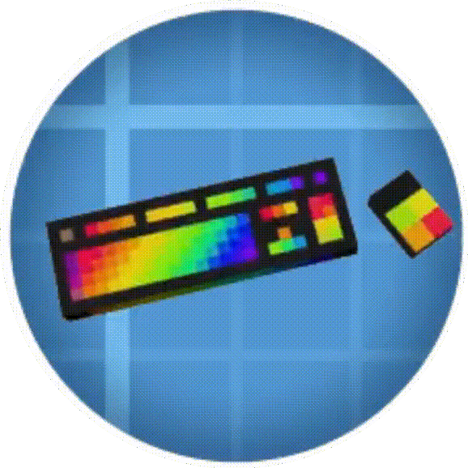

<h1 align="center">Universal Keyboard Controller
 

    
    

</h1>

# Main Features:

 ***Live Control Mode*** --- do you feel like the Aeronautics Typewriter needs an upgrade? Use your keyboard & mouse or GLFW-compatible controller to control redstone signals and more! **You can set a redstone signal less than 15, toggle that signal, or increment it's strength up/down with a keystroke.**
 
 ***Sequencer Mode*** --- visual scripting that can interact with the live controller, so you can be as complex as you need to be! Read Sable sub-level information, and write PID scripts. There are .seq files on my github that you can load into your game to try out

***Advanced Controller Support*** --- enable these in the config files. Use your mouse as a joystick (press alt to freeze camera while in live control), or set up your racing wheel / HOTAS style controllers. Raw axis inputs can be added when "Advanced Controls" are enabled in the config file

# What Can I Control?

### 'Universal' is quite a claim. This mod can't control everything of course. If there's something else that isn't on this list, that you want to control, then please let me know.
----------------------------
### --- Redstone ---

- Local Redstone (N/E/S/W or up/down) without Create installed
- With Create installed, add up to 20 **Redstone Link** frequencies, or 100 **Wireless Copycat** frequencies
- Hold, toggle, and increment actions so you dont need to rely on the toggle lever or accumulator

--------------------------------

### --- CC: Tweaked Peripherals ---

Remotely link the controller to a CC: Tweaked peripheral using shift+right-click. Get getters, and set setters in the sequencer mode

Some "Special compatibilites" have been added. Let me know if you can think of another! They are:
- **Propulsion: Simulated thrusters** can be directly powered with 'Thr' mode, and the vector thrusters can be controled with 'VEC'. You will see these modes next to "RS" if a thruster is linked
- **RPM mode** available for some motors and the rotation speed controller. Should work for any that have CC: Tweaked compat. 
- Display variables or type directly to a CC:Tweaked monitor or computer terminal

-----------------------------------

### --- Create's "Value Panel" ---

This is actually the original purpose of this mode. These are the RPM on the speed controller, the rotation direction of engine, or the settings of a piston. These things can be controlled live in "Value Panel Mode", or in a script in the sequencer mode with "Set Value" line. 

-----------------------------------

### --- Vista Mod --- 

Currently, the only feature available is to view the TV screen on the control wheel or dashboard. Give a linked hollow cassette to the controller, and set up a row number in the configuration files to "Toggle camera". This will be improved in the next version, its not very intuitive now. Toggle the camera to view it on the screen instead of the other stats.

The next update will include actually controlling the viewfinder with a dedicated "CAM" mode in the live controller

--------------------

# Additional Features

1. Sable 2.0 compatibility --- read and use sub-level information (x,y,z, pitch,yaw,etc) in the sequencer mode

2. Overdrive (OD) mode in Live Controls allows you to multiply the power, or incrementing speed of various rows. Exclude rows that can be ignores, allowing for seperate overdrives for seperate rows. Overdrive can be multiplied as well, allowing for gear ratios (customization gear ratios coming in 1.3.5)

3. In-game wiki, which is not done but will be improved upon over time!
4.  'Display' in the sequencer mode allows you to set lines to be read by the Create mod's Display link, as well as displayed on the mod's dashboard and control wheel blocks
5. Import keybindings from an Aeronautics typewriter
6. Dynamic recipes depending on the mods installed (I will take suggestions for more). And there is a server-side config to "make recipe harder" (requires Aeronautics)
7. Animated mouse / keyboard! Press left-alt to freeze camera while in live controls, and watch the mouse move!
